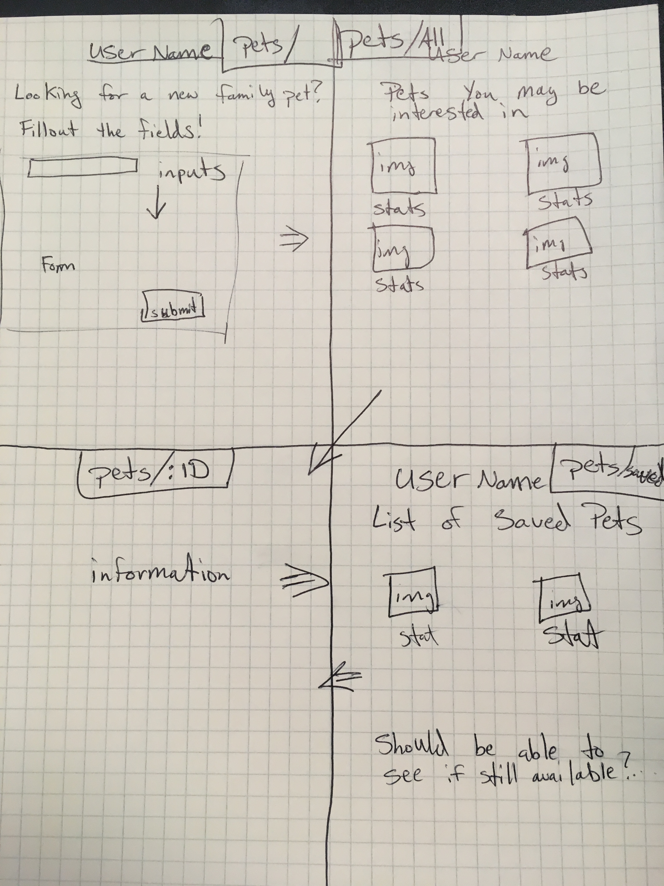
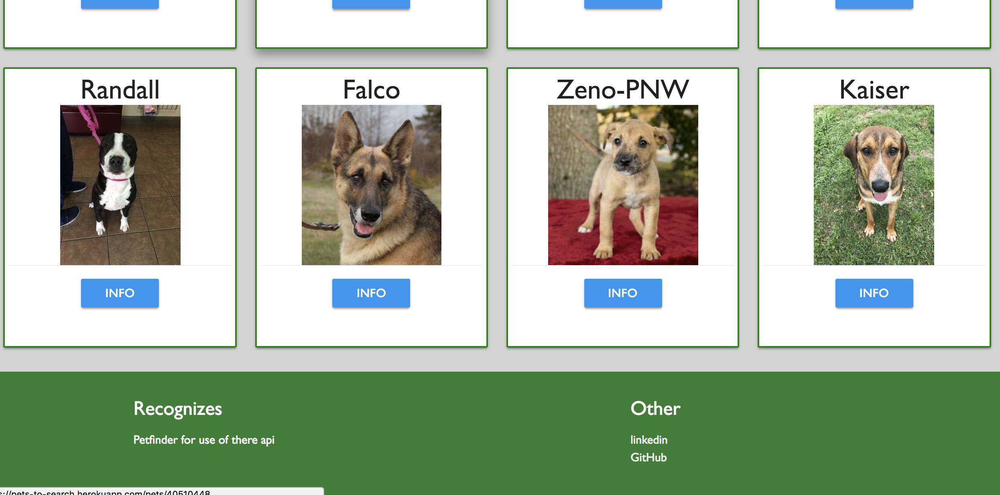
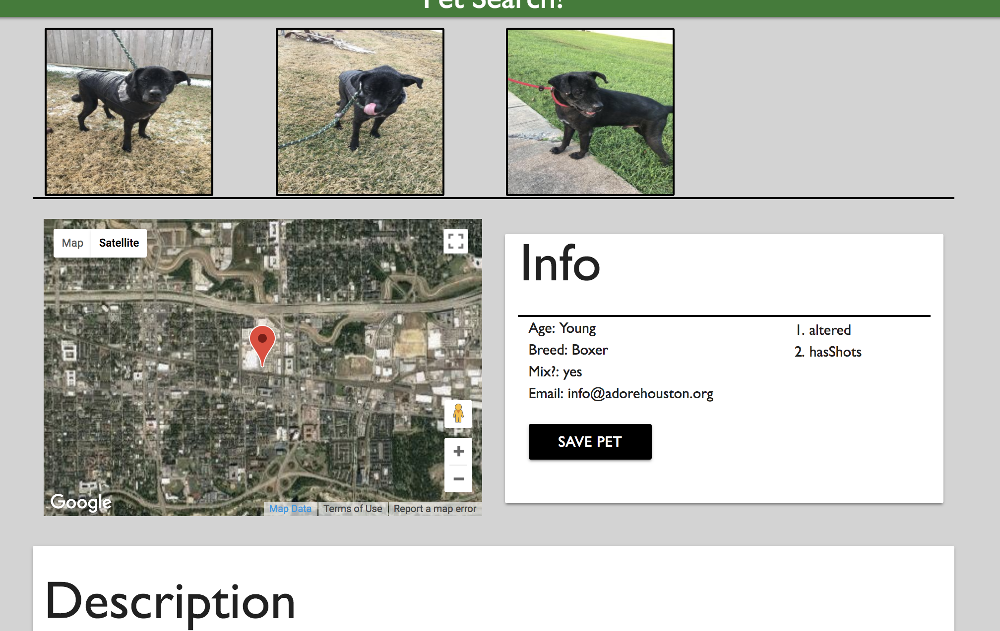
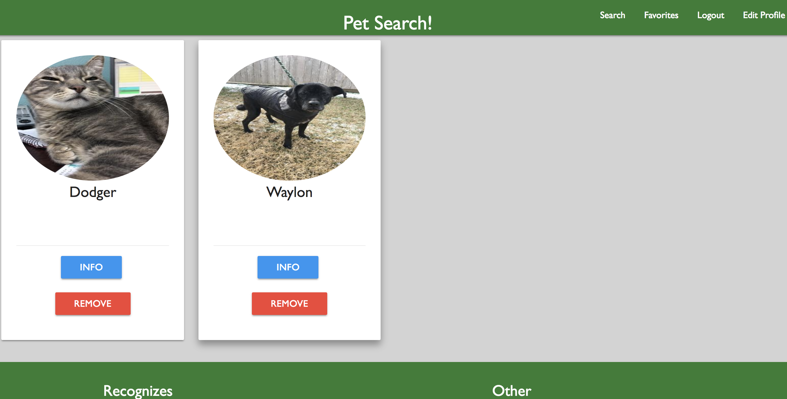

# Pets To Find - Working title

Pet's to find was created as a site to be functionally similiar to ptfinder. The styling of the site uses css and materialize and the functionality was built on javascript and node with node dependencies which can be found in the package.json file. I used the petfinder api to query for data and store subsequent data the user wants my database using postgres sql.

The Website is hosted on heroku and can be viewed here, https://pets-to-search.herokuapp.com/

+HTML +CSS +JavaScript +jQuery +Materialize +PostgresQL +Node.js
Api - Petfinder - Docs - https://www.petfinder.com/developers/api-docs

### How to use this App

1. Sign up with a valid email address.

2. Search for a pet with your zip code.

3. Once you have found a pet you are interested in you can contact the people putting it up for adoption or save it to your favorites to decide later.

### User Stories:

1. I want to adopt a dog in my area.
2. I want to find a rooster to adopt to help me wake up in the mornings.

#### Process

Days 1-2
- Wire frames and models for user and pets were created
- Materialize carousel was implemented for styling.
- Understanding the api and how to get around it's faults

Days 3-4
- Getting the site to have full Crud Routes get, post, put and delete.
- Going over functionality and working with the api's faults.
- Styling using materialize so images coming in weren't stretched

Days 5-6
- Finishing the styling.
- Commenting out the code.
- Hosting the app to Heroku.

## Wireframe and Screen Shots

#### Wireframe

#### Search list for user after searching

#### Pet info page

#### Users favorites list

### Challenges
- Working with the petfinder api was great and a little challenging as well because the api's return info was based on user inputs, hence spelling errors and special characters coming back.
- Also some fields of data could come back as strings or arrays so my functions to be written in 2 ways with conditionals in some cases.
- Working my head around the concept of what users wanted to see and how they want to interact with a site.

### Future Improvements
- Better homepage images, current images are basically place holders.
- Using the offset data with the user so as to show more than 20 pets per search parameters
- Improving functionality to deal with errors having to do with bad user input on the api side and improper search inputs on my end.

## Licensing
Copyright of Brantchyoga. All rights reserved. This site is free for anyone to sign up and use.
